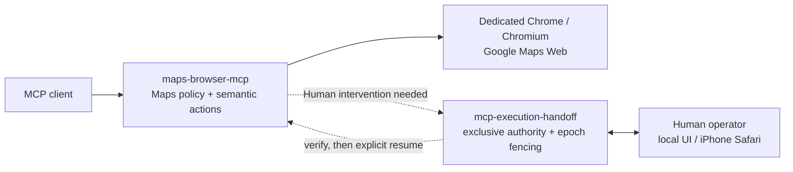

# Maps + Execution Handoff 早見図

`maps-browser-mcp` はGoogle Maps専用のMCP runtimeです。[`mcp-execution-handoff`](https://github.com/git-ksk/mcp-execution-handoff) は、Agentが一時的にHumanへ実行権限を渡す必要がある場面だけで使う再利用可能なcontrol planeです。

## 責務の境界

| Layer | 担当するもの | 担当しないもの |
| --- | --- | --- |
| `maps-browser-mcp` | Maps専用tool、target/state validation、browser/profile policy、Maps固有postcondition | genericなHuman takeover semantics |
| `mcp-execution-handoff` | Agent/Human authority、intervention + epoch fencing、ownership binding、Human takeover session lifecycle、明示resume policy | Google Maps semantics、credential、Maps actionのapproval |
| Human takeover transport | local/nativeやWebRTC direct/TURNなど、boundedなHuman interactionの配送 | Maps authorization、自動replay、credentialをMCP/model dataへ中継すること |

重要なinvariantは、**Humanの完了操作はaction approvalではない**ことです。Humanがsign-in、consent、その他のinterventionを終えても、fresh verificationと適用されるresume policyを通るまでautomationは再開しません。takeoverが終わったという理由だけで、以前のstate-changing Maps actionを再実行することもありません。

## この分離の意味

Google Maps MCP自体を狭い責務に保ちながら、同じHandoff lifecycleを別consumerや別Target Surfaceでも再利用できます。Maps側は「Maps操作として何を意味するか」を担当し、Handoff側は一時的なAgent ↔ Human transitionの間に「誰が操作権限を持つか」を担当します。

設定と実機takeoverの詳細は [WebRTC Human Takeover](webrtc-human-takeover.ja.md) を参照してください。再利用可能なgeneric runtimeについては [`mcp-execution-handoff`](https://github.com/git-ksk/mcp-execution-handoff) を参照してください。
