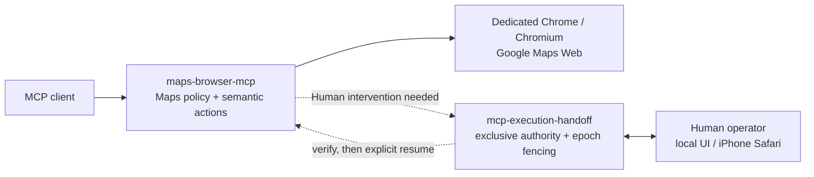

# Maps + Execution Handoff at a glance

`maps-browser-mcp` is the Google Maps-specific MCP runtime. [`mcp-execution-handoff`](https://github.com/git-ksk/mcp-execution-handoff) is the reusable control plane used only when an Agent must temporarily yield execution authority to a Human.

## Responsibility boundary

| Layer | Owns | Does not own |
| --- | --- | --- |
| `maps-browser-mcp` | Maps-specific tools, target/state validation, browser/profile policy, Maps postconditions | generic Human takeover semantics |
| `mcp-execution-handoff` | Agent/Human authority, intervention + epoch fencing, ownership binding, Human takeover session lifecycle, explicit resume policy | Google Maps semantics, credentials, Maps action approval |
| Human takeover transport | bounded Human interaction delivery such as local/native or WebRTC with direct/TURN connectivity | Maps authorization, automatic replay, credential relay into MCP/model data |

The important invariant is that **Human completion is not action approval**. After a Human finishes sign-in, consent, or another intervention, automation resumes only after fresh verification and the applicable resume policy. A prior state-changing Maps action is never replayed merely because takeover ended.

## Why the split matters

This keeps the Google Maps MCP narrow while allowing the same Handoff lifecycle to be reused by other consumers and target surfaces. Maps remains responsible for what a Maps operation means; Handoff remains responsible for who is allowed to act during the temporary Agent ↔ Human transition.

For setup and physical takeover details, see [WebRTC Human Takeover](webrtc-human-takeover.md). For the generic reusable runtime, see the [`mcp-execution-handoff` repository](https://github.com/git-ksk/mcp-execution-handoff).
